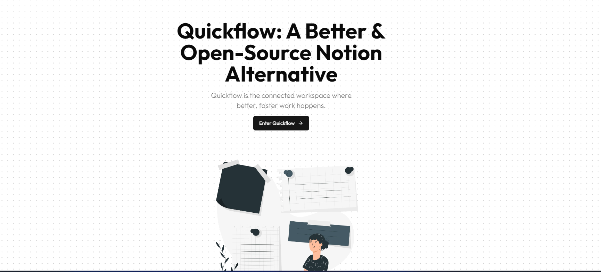
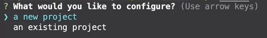
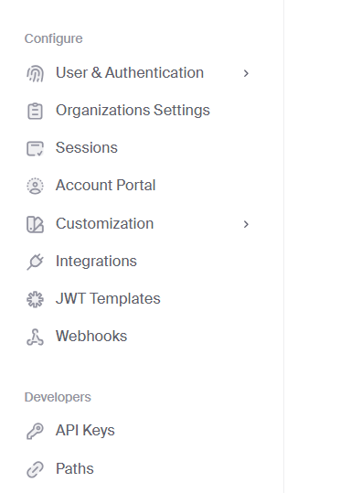
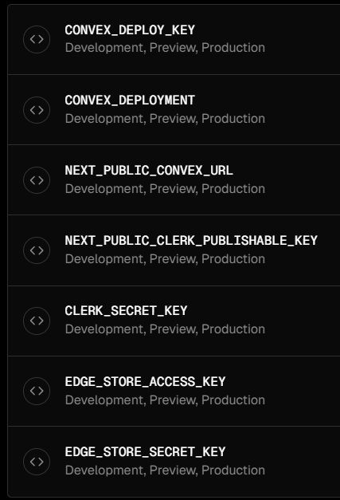

# Quickflow: A Better & Open-Source Alternative to Notion



Quickflow is an open-source alternative to Notion that aims to provide a superior user experience.

## Technologies Used

- [Next.js 13](https://nextjs.org/blog/next-13): A powerful React framework for building modern web applications.
- [Shadcn UI](https://ui.shadcn.com/): Beautifully designed components that you can copy and paste into your apps.
- [Clerk](https://clerk.com/): A complete suite of embeddable UIs, flexible APIs, and admin dashboards to authenticate and manage your users.
- [Convex](https://www.convex.dev/): A Backend Application Platform that keeps you focused on building your product. Convex Functions, Database, File Storage, Scheduling, and Search fit together cohesively.
- [TailwindCSS](https://tailwindcss.com/): A utility-first CSS framework for streamlined web application styling.
- [EdgeStore](https://edgestore.dev/): A service for storing and managing data.

## Key Features

- Real-time database 🔗
- Notion-style editor 📝
- Light and Dark mode 🌓
- Infinite children documents 🌲
- Trash can & soft delete 🗑️
- Authentication 🔐
- File upload, deletion, and replacement
- Icons for each document (changes in real-time) 🌠
- Expandable and fully collapsable sidebar ➡️🔀⬅️
- Full mobile responsiveness 📱
- Publish your note to the web 🌐
- Landing page 🛬
- Cover image for each document 🖼️
- Recover deleted files 🔄📄

## Setting Up the Project Locally

### Prerequisites

Ensure that you have Node.js version 18.x.x or higher installed.


### Cloning the Repository

```shell
git clone https://github.com/Nick-h4ck3r/quickflow.git
cd quickflow
```

### Installing Dependencies

```shell
npm i
```

### Setting Up Convex

1. Create an account on [convex.dev](https://www.convex.dev/)
2. Run the following command:

```shell
npx convex dev
```

3. Follow the prompts to log in and select `a new project` in terminal.



4. A `.env.local` file will be created with `CONVEX_DEPLOYMENT` and `NEXT_PUBLIC_CONVEX_URL` variables.

Keep this terminal running, as the Convex dev server is running locally. If it crashes or closes, run `npx convex dev` again.

### Setting Up Clerk for Authentication

1. Create an account on [clerk.com](https://clerk.com/)
2. Create a new application in the dashboard.
3. Enable social sign-ins (Google and GitHub recommended) and disable email option.
4. Copy the `NEXT_PUBLIC_CLERK_PUBLISHABLE_KEY` and `CLERK_SECRET_KEY` to your `.env.local` file.
5. Now, click on JWT Templates (in left sidebar) option in convex project dashboard.



6. Click on `Create New Template` and select `convex`.

7. Copy the issuer URL and update the `domain` in `convex/auth.config.js`:

```javascript
export default {
  providers: [
    {
      domain: "https://your-issuer-url.clerk.accounts.dev",
      applicationID: "convex",
    },
  ],
};
```

### Setting Up EdgeStore for Data Storage

1. Create an account on [edgestore.dev](https://edgestore.dev/)
2. Create a new project in the dashboard.
3. Copy the `EDGE_STORE_ACCESS_KEY` and `EDGE_STORE_SECRET_KEY` to your `.env.local` file.

### Finalizing Environment Setup

Ensure your `.env.local` file looks like this:

```
CONVEX_DEPLOYMENT=
NEXT_PUBLIC_CONVEX_URL=

NEXT_PUBLIC_CLERK_PUBLISHABLE_KEY=
CLERK_SECRET_KEY=

EDGE_STORE_ACCESS_KEY=
EDGE_STORE_SECRET_KEY=
```

### Starting the Development Server Locally Without Docker

```shell
npm run dev
```
### starting the Developement Server With Docker

```
  docker build -t TAG_NAME .
  docker run -p 3000:3000 --env-file .env.local TAG_NAME
```

## Deployment

To deploy the app on Vercel:

1. Import the project to deploy on vecrel.
2. Replace the build command with: `npm run build && npx convex deploy`
3. To get production env for convex, go to convex project, change the environment to `production`.
4. Click on `settings`, and copy the `Deployment URL` to `NEXT_PUBLIC_CONVEX_URL`.
5.After that, click on `Generate Production Deploy Key`, and copy it too.
6. Add the following environment variables in vercel deployment.
   - `CONVEX_DEPLOY_KEY`: convex-generate-production-deploy-key-here
   - `CONVEX_DEPLOYMENT`: convex-generate-production-deploy-key-here
   - `NEXT_PUBLIC_CONVEX_URL` : convex-deployment-url-here
   - `NEXT_PUBLIC_CLERK_PUBLISHABLE_KEY`: Same as in `.env.local`
   - `CLERK_SECRET_KEY`: Same as in `.env.local`
   - `EDGE_STORE_ACCESS_KEY`: Same as in `.env.local`
   - `EDGE_STORE_SECRET_KEY`: Same as in `.env.local`



## Contributing

Contributions are welcome! Please feel free to submit a Pull Request.

## Credits

Special thanks to Antonio for his invaluable tutorial, which served as the foundation for building this app. You can find the tutorial [here](https://youtu.be/0OaDyjB9Ib8?si=D38xIsi46hG7M2sC).

## License

[MIT License](LICENSE)
